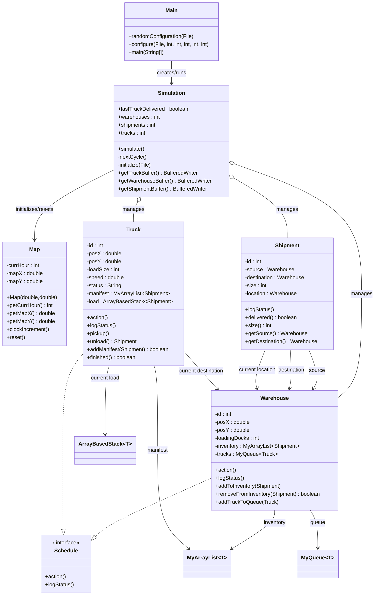

# Transport Network Simulation

A Java-based discrete-time simulation of a transport network with trucks, warehouses, and shipments.
Each simulation hour advances a global clock, updates warehouse loading/unloading, moves trucks,
and writes CSV status logs for later analysis.

## Overview

The simulation models:

- **Warehouses** with fixed map positions, loading docks, shipment inventory, and truck queues.
- **Shipments** with source warehouse, destination warehouse, and load size (1–3).
- **Trucks** with position, speed, load capacity, a manifest, and delivery/pickup behavior.
- A global **Map** with x/y bounds and a simulation clock.

Core execution flow:

1. Load a generated configuration file.
2. Build warehouse, shipment, and truck objects.
3. Run hourly cycles until all trucks are finished.
4. Persist object state snapshots to CSV logs.

## UML Diagram (Your Transport Simulation)



> If your Git host does not render Mermaid blocks, copy this diagram into mermaid.live or a Markdown preview that supports Mermaid.

## Project Structure

```text
src/main/java/
  simulation/
    Main.java         # Entry point + config generation (random or user-defined)
    Simulation.java   # Simulation lifecycle and per-hour processing
  models/
    Map.java
    Schedule.java
    Shipment.java
    Truck.java
    Warehouse.java
  datastructures/
    MyArrayList.java
    MyQueue.java
    QueueNode.java
    ArrayBasedStack.java
    BasicQueue.java
    BasicStack.java

src/test/java/test/   # JUnit tests
```

## Prerequisites

- **Java 17**+
- **Maven 3.8+** (or compatible)

## Build & Test

```bash
mvn clean test
```

## Run the Simulation

### Option 1: Run from Maven

```bash
mvn -q exec:java -Dexec.mainClass="simulation.Main"
```

> If `exec-maven-plugin` is not configured in your environment, use Option 2.

### Option 2: Compile and run directly

```bash
mvn -q -DskipTests compile
java -cp target/classes simulation.Main
```

The program is interactive and lets you:

1. Exit,
2. Run with random default configuration,
3. Run with user-provided map size and object counts.

## Configuration Generation

`Main` writes a configuration file consumed by `Simulation`.

- **Random mode** generates values within bounded ranges.
- **User-defined mode** validates inputs and then generates matching objects.

Validation constraints in user-defined mode:

- map x/y: **1–1000**
- trucks: **1–5000**
- warehouses: **2–5000**
- shipments: **1–10000**

## Output Logs

Each run overwrites and recreates these CSV files in the project root:

- `TrucksCSV.txt`
- `WarehousesCSV.txt`
- `ShipmentsCSV.txt`

These include one row per object per simulated hour and can be imported into spreadsheets
or notebooks for analysis/visualization.

## Design Notes

- IDs for trucks, warehouses, and shipments are generated incrementally per run.
- Warehouse inventory is kept sorted by shipment ID for lookup/removal efficiency.
- Truck manifests are prioritized and updated after each pickup/unload event.
- The map clock and IDs are reset after simulation completes.

## Future Improvements

- Real-time visualization
- Web dashboard
- Route optimization
- REST API integration
- Interactive map

## License

This project is licensed under the terms in [LICENSE](LICENSE).
